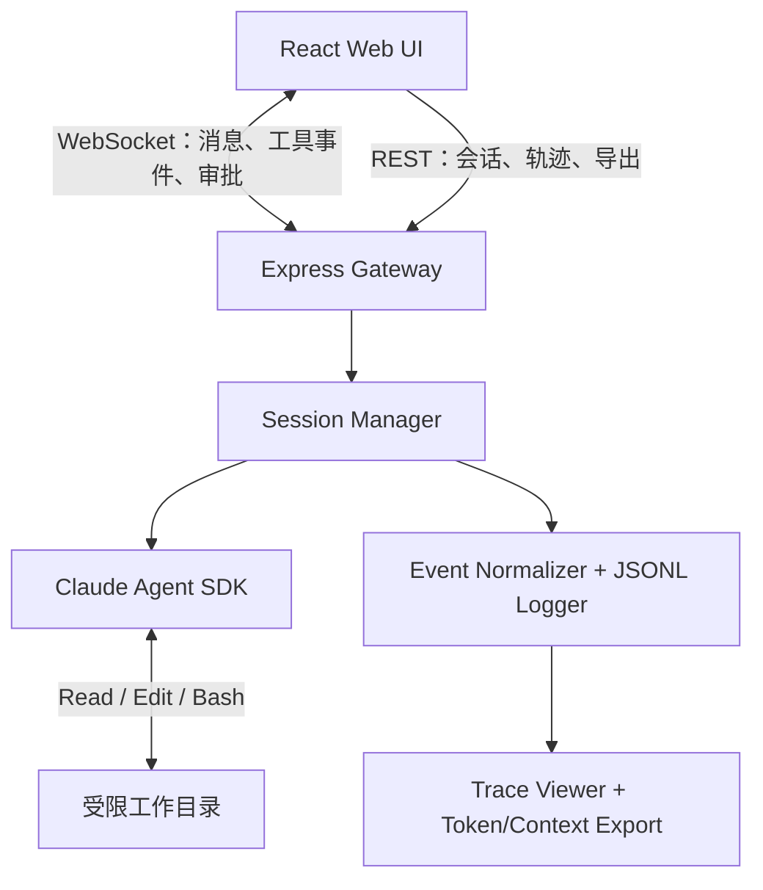

# Assignment 1：Claude Agent SDK Web UI 完整改造 TODO

> 适用基线：已能在 Windows 本地运行 Claude Agent SDK，并已使用第三方 Anthropic 兼容 API 完成正常对话。
>
> 本文件同时承担：实施计划、任务清单、验收标准、运行审查记录、修改摘要、结果摘要和运行指南。除源代码、测试代码及程序运行必需生成的 JSONL/CSV 数据外，不再创建额外的进度、总结或说明 Markdown 文件。

## 0. 最终目标

在现有 Claude Agent SDK Web UI 上完成一个可观测、可控制、可恢复的真实智能体会话系统，使浏览器能够：

- 驱动 Claude Agent SDK 在指定工作目录中读取文件、修改文件并运行命令；
- 实时展示模型消息、`tool_use`、`tool_result`、错误及任务最终状态；
- 支持 Stop、工具审批和同一会话恢复；
- 将完整可观测轨迹保存为 JSONL；
- 提供 Trace Viewer、Token 账本和上下文分类 CSV 导出；
- 完成一次真实文件读取调用展示；
- 每个阶段完成后主动运行、审查、提交并推送；
- 最终在本文件内填写修改摘要、结果摘要和运行指南。

## 1. 范围与约束

### 1.1 已完成前提

- [x] Windows 本地可以运行 Node.js/npm。
- [x] Claude Agent SDK 已成功安装并运行。
- [x] 第三方 Anthropic 兼容 API 已完成对话验证。
- [x] API Key 只由后端环境变量或本机配置读取，不进入前端。

### 1.2 实施约束

- [x] 不把 API Key、认证 Token、完整请求头写入源码、JSONL、截图或 Git 历史。
- [x] 后端日志中的敏感字段统一脱敏；至少覆盖 `authorization`、`x-api-key`、`ANTHROPIC_AUTH_TOKEN`、`ANTHROPIC_API_KEY`。
- [x] 工作目录必须被限制在允许的根目录内，拒绝路径穿越和任意绝对路径访问。
- [x] 不启用无条件绕过权限的模式作为默认配置。
- [x] 不记录或声称导出隐藏思维链；仅记录可观测消息、工具调用、工具结果、错误、用量和系统元数据。
- [x] 不为了“看起来完成”而吞掉错误、伪造 Token 数、伪造测试通过或伪造 push 成功。
- [x] 所有计划、审查、摘要和指南都回填到本文件；不要创建 `progress.md`、`summary.md`、`test-report.md` 等中间文档。

## 2. 建议最小架构



### 2.1 模块职责

| 模块 | 职责 |
|---|---|
| Web UI | 对话、工具卡片、Stop、审批弹窗、会话恢复、Trace Viewer |
| Express Gateway | REST/WebSocket 接口、输入验证、错误响应、静态资源 |
| Session Manager | `chatId`、SDK `sessionId`、工作目录、运行状态和订阅者管理 |
| Agent Adapter | 调用 SDK、接收输入、消费 SDK 事件、Stop/Resume |
| Event Normalizer | 将 SDK 原始消息转换为稳定的应用事件模型 |
| Trajectory Logger | 按事件追加 JSONL，保证顺序、时间戳、脱敏和落盘 |
| Trace Analyzer | Token 汇总、上下文分类、CSV/JSONL 导出 |

## 3. 统一事件与数据规范

### 3.1 统一事件类型

实现前先根据当前安装的 SDK 类型定义核对真实字段；不要仅凭示例猜测字段名称。

```ts
type AgentEvent =
  | { type: "user_message"; eventId: string; sequence: number; timestamp: string; chatId: string; content: string }
  | { type: "assistant_message"; eventId: string; sequence: number; timestamp: string; chatId: string; content: string }
  | { type: "tool_start"; eventId: string; sequence: number; timestamp: string; chatId: string; toolUseId: string; toolName: string; input: unknown }
  | { type: "tool_result"; eventId: string; sequence: number; timestamp: string; chatId: string; toolUseId: string; output: unknown; isError: false; durationMs?: number }
  | { type: "tool_error"; eventId: string; sequence: number; timestamp: string; chatId: string; toolUseId?: string; toolName?: string; error: NormalizedError; durationMs?: number }
  | { type: "permission_request"; eventId: string; sequence: number; timestamp: string; chatId: string; requestId: string; toolName: string; input: unknown }
  | { type: "permission_result"; eventId: string; sequence: number; timestamp: string; chatId: string; requestId: string; decision: "allow" | "deny"; reason?: string }
  | { type: "run_result"; eventId: string; sequence: number; timestamp: string; chatId: string; status: "success" | "error" | "stopped"; durationMs?: number; usage?: TokenUsage; costUsd?: number }
  | { type: "system"; eventId: string; sequence: number; timestamp: string; chatId: string; level: "info" | "warning" | "error"; message: string };
```

### 3.2 JSONL 最低字段

每行必须是一个独立且有效的 JSON 对象：

```json
{"schemaVersion":1,"runId":"run-...","chatId":"chat-...","sdkSessionId":"...","sequence":12,"timestamp":"2026-09-01T12:00:00.000Z","eventType":"tool_result","toolName":"Read","toolUseId":"tool-123","output":{"summary":"..."},"isError":false,"durationMs":18}
```

必须包含：

- `schemaVersion`；
- `runId`、`chatId`、可获得时记录 `sdkSessionId`；
- 单调递增的 `sequence`；
- UTC ISO 8601 `timestamp`；
- `eventType`；
- 事件有效载荷；
- 工具调用关联字段 `toolUseId`；
- 错误状态、耗时和可获得的 usage；
- 脱敏后的内容。

### 3.3 错误格式

```ts
interface NormalizedError {
  code?: string;
  name?: string;
  message: string;
  stack?: string;
  source: "sdk" | "tool" | "websocket" | "http" | "storage" | "validation";
  retryable?: boolean;
}
```

前端显示简洁错误，Trace Viewer 可展开详细错误；敏感信息在进入两者之前完成脱敏。

---

# 阶段 A：增加 tool_result、错误、时间戳和 JSONL 轨迹

## A1. 先检查现有实现

- [ ] 检查项目结构、`package.json`、TypeScript 配置和现有测试命令。
- [ ] 找到 Agent SDK `query()` 或 Session API 的调用位置。
- [ ] 找到 SDK 消息转换和 WebSocket 广播位置。
- [ ] 找到当前 `tool_use` 的渲染逻辑。
- [ ] 检查当前 SDK 版本的真实消息类型，确认 `assistant`、`user/tool_result`、`result` 和流式事件结构。
- [ ] 在本阶段记录区填写检查结果，不创建额外分析文档。

## A2. 实现事件标准化

- [ ] 新增或重构统一的事件标准化函数，SDK 原始事件不得直接散落到多个前端组件中解析。
- [ ] 将文本消息转换为 `assistant_message`。
- [ ] 将工具调用转换为 `tool_start`，保存 `toolUseId`、工具名和输入。
- [ ] 将工具返回转换为 `tool_result`；使用同一个 `toolUseId` 与 `tool_start` 配对。
- [ ] 将失败的工具返回转换为 `tool_error`，保留错误信息和可获得的退出码。
- [ ] 将 SDK 顶层异常、WebSocket 错误和存储错误转换为标准错误事件。
- [ ] 为每个事件增加 `eventId`、`sequence` 和 UTC `timestamp`。
- [ ] 同一 `chatId` 内的 `sequence` 必须严格递增，不因多个订阅者而重复递增。
- [ ] 不将同一个工具结果重复记为 `tool_result` 和普通用户消息。

## A3. 实现 JSONL 轨迹记录

- [ ] 建立单一 Trajectory Logger；路径建议为 `traces/<chatId>/<runId>.jsonl`。
- [ ] 使用追加写入，避免每次事件重写整个文件。
- [ ] 在事件广播给前端之前或同一控制点完成持久化，明确并记录顺序策略。
- [ ] 对并发写入进行串行化，避免 JSON 行交错。
- [ ] 程序异常退出后，已完成事件仍应保留。
- [ ] 日志写入失败时生成 `storage` 错误，但避免递归地再次写入同一个失败 Logger。
- [ ] 加入递归脱敏函数，覆盖对象、数组和字符串中的常见凭证字段。
- [ ] 增加轨迹查询/下载接口，例如 `GET /api/chats/:chatId/traces` 和 `GET /api/traces/:runId/raw`。

## A4. 前端工具结果与错误展示

- [ ] 工具卡片至少显示：工具名、状态、开始时间、耗时、输入、输出摘要。
- [ ] `Bash` 结果显示退出码，并分别展示 stdout/stderr（如果 SDK 提供）。
- [ ] `Read` 结果显示文件路径和可折叠内容，避免默认展开超长文件。
- [ ] 错误卡片显示来源、错误信息和是否可重试。
- [ ] 工具运行状态按 `toolUseId` 更新同一卡片，不为结果额外创建无法关联的新卡片。
- [ ] 超长输出在 UI 中折叠，但 JSONL 保留经过合理上限控制的原始可观测输出；若截断必须记录 `truncated: true` 和原始长度。

## A5. 自动测试

- [ ] 单元测试：相同 `toolUseId` 的 start/result 能正确配对。
- [ ] 单元测试：工具错误能转换为 `tool_error`。
- [ ] 单元测试：sequence 单调递增。
- [ ] 单元测试：每条 JSONL 都能独立 `JSON.parse()`。
- [ ] 单元测试：API Key、Authorization Header 被脱敏。
- [ ] 集成测试：模拟 SDK 事件后，WebSocket 客户端收到正确顺序的事件。
- [ ] 运行类型检查、单元测试和生产构建。

## A6. 主动运行审查

- [ ] 启动后端和前端，确认没有未处理异常。
- [ ] 创建一个真实会话，发送简单任务，观察 assistant/tool/result 时间线。
- [ ] 检查浏览器控制台、后端控制台和网络面板。
- [ ] 检查生成的 JSONL 行数、顺序、时间戳、事件配对和脱敏情况。
- [ ] 故意触发一次安全的文件不存在错误，确认错误可见且不会导致服务崩溃。
- [ ] 将实际命令和结果填写到“A 阶段记录”。

## A7. Git 提交与 Push

- [ ] `git status --short`，确认没有密钥、`.env`、真实轨迹或无关文件进入提交。
- [ ] `git diff --check`。
- [ ] 重新运行本阶段必需的 typecheck/test/build。
- [ ] 仅暂存本阶段相关代码和本 TODO 的记录更新。
- [ ] 建议提交信息：`feat(trace): persist tool results errors and jsonl events`。
- [ ] 执行 `git push origin HEAD`。
- [ ] 记录 commit SHA、push 结果；push 失败必须记录真实原因，不得标记完成。

### A 阶段记录（完成后填写）

- 修改摘要：`新增统一 AgentEvent、SDK Event Normalizer、递归脱敏、串行 JSONL Logger、轨迹 REST 下载接口，以及前端可配对的工具运行/结果/错误卡片。修复 traces 写入触发 tsx watch 重启后端的问题。`
- 关键文件：`server/events.ts、server/event-normalizer.ts、server/trajectory.ts、server/redaction.ts、server/session.ts、client/App.tsx、client/components/ChatWindow.tsx`
- 测试命令：`npm run typecheck；npm test（5/5）；npm run build -- --emptyOutDir；真实 REST/WebSocket/Agent SDK smoke test`
- 运行审查：`Chat 404073e8-83eb-4717-b9d4-5fb04e8a6c62；Read 成功 run-01febd03-dd14-4ab6-acc8-b0a209a305fc（sequence 1-6）；不存在文件 run-1ea36a9b-a630-4663-9f42-30b8aab0b310（sequence 7-12）；toolUseId 均正确配对；两份 JSONL 逐行可解析且密钥扫描通过。`
- 已知限制：`当前环境没有可用的内置浏览器，无法执行浏览器控制台和截图审查；已用生产构建及网页同协议的 REST/WebSocket 真实链路验证。B/C 阶段功能尚未实现。`
- Commit SHA：`e7bb9b2075af23b9c21ffbfe89ae627890ae8d69`
- Push 结果：`首次三次尝试因 GitHub HTTPS schannel TLS 握手失败；阶段 B push 时已成功推送至 origin/main。`

---

# 阶段 B：增加工作目录、Stop、工具审批和会话恢复

## B1. 工作目录

- [ ] 配置服务端允许的工作区根目录，例如通过 `AGENT_WORKSPACE_ROOT` 指定。
- [ ] 创建会话时允许选择根目录内的相对项目路径。
- [ ] 使用 `path.resolve()` 后验证目标仍位于允许根目录内。
- [ ] 拒绝 `..` 穿越、UNC 路径、盘符跳转和符号链接逃逸；Windows 路径比较需处理大小写和分隔符。
- [ ] 验证目标存在且为目录。
- [ ] 将最终规范化 `cwd` 保存到会话元数据中。
- [ ] 创建 Agent SDK 会话时传入 `cwd`，不要只在界面上显示工作目录。
- [ ] 页面明显展示当前工作目录和只读/可写状态。

## B2. Stop

- [ ] 检查当前 SDK 版本支持的中断方式，优先使用公开的 AbortController/interrupt API。
- [ ] 为每次运行维护独立的 abort/interrupt 句柄。
- [ ] 新增 `stop` WebSocket 事件或 REST 接口，例如 `POST /api/chats/:chatId/stop`。
- [ ] Stop 后把运行状态设置为 `stopped`，记录操作者、时间和最终事件。
- [ ] 重复 Stop 必须幂等，不得抛出未处理异常。
- [ ] Stop 后保留已有轨迹，允许用户发送新消息继续同一会话或显式恢复。
- [ ] 前端仅在 `running`/`waiting_permission` 状态显示可用 Stop 按钮。

## B3. 工具审批

- [ ] 使用 SDK 当前版本公开的 `canUseTool`/权限回调，不通过修改 SDK 内部代码实现。
- [ ] 默认策略建议：只读工具自动允许；写文件、执行命令及高风险工具必须询问。
- [ ] 后端生成唯一 `requestId`，广播 `permission_request`。
- [ ] 前端弹窗显示工具名、输入摘要、完整可折叠输入、Allow/Deny。
- [ ] 前端通过 WebSocket 或 REST 返回 `permission_result`。
- [ ] 后端用 `requestId` 解析对应 Promise，不能把一个审批结果发给另一个工具调用。
- [ ] 审批必须有超时；超时默认拒绝并记录原因。
- [ ] 客户端断开时，待处理审批必须拒绝或进入明确的安全等待状态。
- [ ] 对“本会话始终允许”建立会话级白名单；默认不跨会话持久化。
- [ ] Allow、Deny、Timeout 都写入 JSONL。

## B4. 会话恢复

- [ ] 明确区分应用 `chatId` 与 Claude SDK `sessionId`。
- [ ] 首次获得 SDK `sessionId` 后写入会话元数据和轨迹。
- [ ] 重启后读取会话索引及 transcript/SDK session 映射。
- [ ] 使用当前 SDK 官方 Resume/Session API 恢复对话，不通过把网页聊天文本简单拼接成新提示冒充恢复。
- [ ] 恢复前验证原工作目录仍存在，并显示当前文件系统不是历史快照。
- [ ] 恢复失败时保留原记录并给出明确错误，不自动创建一个看似相同的新会话。
- [ ] 页面显示 `new`、`running`、`waiting_permission`、`stopped`、`completed`、`error`、`resumable` 等状态。

## B5. 自动测试

- [ ] 工作目录正常路径测试。
- [ ] `../`、其他盘符、UNC 和符号链接逃逸测试。
- [ ] Stop 正常中断、重复 Stop 和已完成后 Stop 测试。
- [ ] 工具 Allow、Deny、Timeout、客户端断开测试。
- [ ] 两个并发审批不会串线。
- [ ] 服务重启后恢复同一 SDK session 的集成测试。
- [ ] 工作目录丢失时恢复失败的测试。
- [ ] 运行 typecheck、test、build。

## B6. 主动运行审查

- [ ] 在允许工作目录中运行真实只读任务。
- [ ] 触发一次需要批准的工具调用，分别验证 Allow 和 Deny。
- [ ] 启动一个持续时间足够长的安全任务，点击 Stop，确认停止事件写入轨迹。
- [ ] 重启后端，恢复已有会话并追问一个依赖上一轮上下文的问题。
- [ ] 确认恢复后工作目录正确，历史消息和新事件没有重复。
- [ ] 检查断开重连和审批弹窗状态。
- [ ] 将实际结果填写到“B 阶段记录”。

## B7. Git 提交与 Push

- [ ] 检查 Git 状态、敏感数据和无关文件。
- [ ] 运行 `git diff --check` 和完整验证命令。
- [ ] 建议提交信息：`feat(session): add workspace stop approvals and resume`。
- [ ] 执行 `git push origin HEAD`。
- [ ] 记录 commit SHA 和远端结果。

### B 阶段记录（完成后填写）

- 修改摘要：`新增持久化 ChatStore、工作区解析器、会话状态、SDK session 映射与 Resume；接入 canUseTool 审批、超时默认拒绝、断线拒绝、会话级 always allow；Stop 调用 Query.interrupt() 并记录 stopped run_result。`
- 安全边界：`AGENT_WORKSPACE_ROOT 内相对路径；path.resolve + realpath 双重验证；拒绝 ../、绝对路径、其他盘符、UNC 与符号链接逃逸；真实 API 对 ../ 和 C:\\Windows 均返回 HTTP 400。`
- 测试命令：`npm run typecheck；npm test（8/8）；npm run build -- --emptyOutDir；真实 REST/WebSocket/SDK 控制与恢复脚本。`
- Allow/Deny/Stop/Resume 审查：`Chat 8d1edc60-e43b-463b-b001-21323ca93687；Deny request 73b02adb-2e7d-4805-8888-b7cd7860aa47（seq 4-6）；Allow request 546e3d89-fdb1-4b7c-af06-c43c641b4e95（seq 12-14）；Stop run-14114318-2163-4fa3-b7c2-4930bd83f436（seq 22）；重启后使用 SDK session f805fd35-ec16-4984-b435-06830b71fcdb 恢复并正确回答 ALLOW_MARKER。`
- 已知限制：`未在真实运行中等待 60 秒验证 timeout，但实现为默认拒绝；客户端断开同样默认拒绝。当前环境无可用内置浏览器，UI 仅通过类型检查和生产构建验证。`
- Commit SHA：`5ec3852c3b92d3c346e50cc7e37823d811cb731f`
- Push 结果：`成功推送至 origin/main，同时补推阶段 A。`

---

# 阶段 C：增加 Trace Viewer、Token 账本和上下文分类导出

## C1. Trace Viewer

- [ ] 增加独立 Trace 视图或对话页签，不必追求复杂视觉效果。
- [ ] 按 `sequence` 显示事件时间线。
- [ ] 支持按事件类型过滤：user、assistant、tool、permission、error、result、system。
- [ ] 支持按工具名、错误状态和 runId 过滤。
- [ ] 每个事件显示时间戳、相对耗时、事件编号和关联 ID。
- [ ] `tool_start` 与 `tool_result/tool_error` 在视觉上明确配对。
- [ ] 支持折叠长输入/输出，显示是否截断。
- [ ] 支持下载原始 JSONL；下载内容必须与持久化记录一致。
- [ ] Trace Viewer 不显示未脱敏凭证。

## C2. Token 账本

- [ ] 从 SDK `result` 或 usage 字段提取可获得的输入、输出、缓存读写和总 Token。
- [ ] 保存模型名称、开始时间、结束时间、墙钟耗时和可获得成本。
- [ ] 以 run/turn 为粒度汇总，禁止对未知字段填 0 后假装精确。
- [ ] SDK 未提供精确分项时标记为 `unavailable` 或 `estimated`。
- [ ] 如果进行估算，保存估算方法和 tokenizer/字符近似规则。
- [ ] Trace Viewer 至少显示：input、output、cache、total、cost、duration、measurement type。
- [ ] 防止恢复会话后重复累计同一个 `result`。

建议数据结构：

```ts
interface TokenLedgerEntry {
  runId: string;
  model?: string;
  inputTokens?: number;
  outputTokens?: number;
  cacheReadTokens?: number;
  cacheWriteTokens?: number;
  totalTokens?: number;
  costUsd?: number;
  durationMs?: number;
  measurement: "reported" | "estimated" | "unavailable";
}
```

## C3. 上下文分类

对实际进入或持续占用上下文的可观测内容进行分类，不将 UI 状态误认为模型上下文。

最低分类：

| `contextCategory` | 内容示例 |
|---|---|
| `system_harness` | 系统提示、权限模式、工作目录信息 |
| `tool_definition` | 工具名称与 schema；若 SDK 不暴露则标记 unavailable |
| `project_instruction` | `CLAUDE.md`、项目规则 |
| `user_message` | 用户初始任务和后续纠正 |
| `assistant_message` | 可观测模型输出 |
| `file_content` | Read 返回的文件内容 |
| `search_listing` | Glob、Grep、目录和搜索结果 |
| `command_output` | Bash stdout/stderr、退出码 |
| `tool_error` | 工具错误、异常和失败状态 |
| `edit_result` | Write/Edit 的修改确认或 diff |
| `permission_context` | 工具审批请求与决定 |
| `compaction_summary` | SDK 可观测的压缩摘要（如果存在） |
| `other` | 无法可靠归类的可观测上下文 |

同时增加效用标签：

- `necessary`：直接影响后续决策；
- `supporting`：有帮助但可压缩；
- `redundant`：重复读取或重复输出；
- `stale`：已被新文件或新结果替代；
- `harmful`：截断、错误或误导性内容。

- [ ] 实现确定性优先的分类规则，保存规则版本。
- [ ] 每条可分类事件保存 category、utility、字节数和估算 Token。
- [ ] 不可观察内容必须标记 unavailable，不作臆测。
- [ ] 增加 CSV 导出接口，例如 `GET /api/traces/:runId/context.csv`。
- [ ] CSV 至少包含：sequence、timestamp、eventType、contextCategory、utility、source、bytes、estimatedTokens、toolName、truncated。
- [ ] 正确转义逗号、引号、换行和 Unicode。
- [ ] 页面显示按类别的 Token/字节统计表；图表为可选，不影响最低验收。

## C4. 自动测试

- [ ] Trace 过滤与排序测试。
- [ ] JSONL 下载与落盘内容一致性测试。
- [ ] Token 汇总不重复累计测试。
- [ ] `reported/estimated/unavailable` 标记测试。
- [ ] 典型 Read/Bash/Edit 事件的上下文分类测试。
- [ ] CSV 引号、逗号、中文和多行内容转义测试。
- [ ] 敏感值不会出现在 Trace Viewer 和导出文件的测试。
- [ ] 运行 typecheck、test、build。

## C5. 主动运行审查

- [ ] 使用真实会话生成包含 assistant、Read、result 的轨迹。
- [ ] 打开 Trace Viewer，检查顺序、配对、过滤和长文本折叠。
- [ ] 对照原始 SDK `result` 检查 Token 数和成本，确认未重复累计。
- [ ] 下载 JSONL 并逐行解析。
- [ ] 下载 context CSV，用 Excel 或文本方式检查中文、逗号和换行。
- [ ] 检查分类合计与事件总数/估算 Token 逻辑一致。
- [ ] 将实际结果填写到“C 阶段记录”。

## C6. Git 提交与 Push

- [ ] 检查 Git 状态、敏感信息和不应提交的真实轨迹。
- [ ] 运行 `git diff --check` 和完整验证。
- [ ] 建议提交信息：`feat(analysis): add trace viewer token ledger and context export`。
- [ ] 执行 `git push origin HEAD`。
- [ ] 记录 commit SHA 和远端结果。

### C 阶段记录（完成后填写）

- 修改摘要：`新增 Trace Viewer 页签、事件类型/工具/错误过滤、JSONL/CSV 下载、Token 账本、上下文类别统计，以及规则版本 1.0.0 的确定性分类器。`
- Trace Viewer 结果：`Run run-e222a47d-257b-4c54-a1d9-d0f9c3d748f4 共 8 条事件；Bash 过滤得到 4 条；下载 JSONL 与落盘文件 SHA-256 完全一致（888F2762...AB4）。`
- Token 账本结果：`SDK result 报告 measurement=reported、totalTokens=13233；按 eventId 去重，未知字段显示 unavailable，不填充伪 0。`
- 上下文分类/CSV 结果：`该 run 得到 7 个类别；CSV 含 UTF-8 BOM、9 行（含表头），字段覆盖 sequence/timestamp/category/utility/bytes/estimatedTokens/toolName/truncated/ruleVersion；导出密钥扫描通过。`
- 测试命令：`npm run typecheck；npm test（12/12）；npm run build -- --emptyOutDir；REST 过滤/summary/raw/context.csv 审查。`
- 已知限制：`estimatedTokens 使用 UTF-8 bytes/4 近似并明确标为 estimated；SDK 未暴露的隐藏上下文不推测。当前环境无可用内置浏览器，Trace Viewer 通过类型检查、构建和 API 数据验证，未完成截图审查。`
- Commit SHA：`8c730cc5be302a78ee690bf785ba0035e175768f`
- Push 结果：`成功推送至 origin/main。`

---

# 阶段 D：真实文件调用展示

## D1. 演示目标

完成一次容易复现、不会破坏项目的真实文件读取调用，并在网页和轨迹中展示完整闭环：

```text
用户任务 → tool_start(Read) → tool_result → assistant 总结 → run_result
```

## D2. 建议演示任务

优先读取项目现有的 `package.json`，避免额外创建演示文件。发送：

```text
请使用文件读取工具读取当前工作目录中的 package.json。
不要修改任何文件，也不要运行安装命令。
请告诉我：
1. 项目名称；
2. 可用的 npm scripts；
3. 与 Claude Agent SDK、前端和后端相关的主要依赖。
必须以实际读取结果为依据；如果文件不存在，请明确报告错误。
```

## D3. 验收证据

- [ ] UI 显示 `Read` 工具卡片，而不是只有最终回答。
- [ ] 工具卡片状态从 running 变为 success 或 error。
- [ ] `tool_start` 包含工具名、文件路径、时间戳和 `toolUseId`。
- [ ] `tool_result` 使用相同 `toolUseId`。
- [ ] 最终回答与实际 `package.json` 内容一致。
- [ ] JSONL 中事件顺序完整且每行可解析。
- [ ] Trace Viewer 能筛选到本次 Read 调用。
- [ ] Token 账本包含本次运行，或明确标记 unavailable。
- [ ] Context CSV 将 Read 内容归类为 `file_content`。
- [ ] 演示记录不包含 API Key。

## D4. 主动运行审查

- [ ] 在浏览器中完成上述真实任务。
- [ ] 直接打开 `package.json`，人工核对智能体总结。
- [ ] 刷新页面，确认轨迹仍可查看。
- [ ] 若应用支持恢复，重启后端后再次打开该会话。
- [ ] 检查浏览器控制台、服务器日志和 JSONL。
- [ ] 在下方填写事件编号，不另外创建演示报告。

## D5. Git 提交与 Push

如果本阶段只产生被 `.gitignore` 排除的本地轨迹，不要提交真实运行数据；更新本 TODO 的脱敏结果记录并提交。

- [ ] 建议提交信息：`test(e2e): verify observable file-read trajectory`。
- [ ] 执行 `git push origin HEAD`。
- [ ] 记录 commit SHA 和远端结果。

### D 阶段记录（完成后填写）

- 演示日期与模型：`2026-09-01；deepseek-v4-pro-0813`
- 工作目录：`AGENT_WORKSPACE_ROOT 内的 .（脱敏相对路径）`
- Run ID：`run-cad02671-30f1-4671-b77b-01efe1703961；Chat 5212a1fa-03a2-47c8-8bcd-2ef3043f1444；SDK session 6045d7e0-cfb0-49eb-a6b2-6109480d2210`
- `tool_start` sequence：`第一次 Read seq 5（toolu_2c5afc08ac4647a78def86e2，Unix 风格路径）；恢复后的 Read seq 12（toolu_41111a96146944d0b0400f34，Windows 路径）`
- `tool_result/tool_error` sequence：`第一次 Read tool_error seq 6；恢复后的 Read tool_result seq 13；两组 toolUseId 均正确配对。`
- `run_result` sequence：`15，status=success`
- 人工核对结果：`回答中的 name=simple-chatapp；scripts=dev/dev:server/dev:client/start/typecheck/test/build；SDK、React/Vite、Express/ws 等依赖均与 package.json 一致。模型先因路径格式失败，再自行恢复成功；未修改文件、未运行安装命令。`
- Trace/Token/CSV 验证：`JSONL 共 15 条且密钥扫描通过；Token ledger measurement=reported，input=6252/output=1639/cacheRead=34816/cacheWrite=0/total=42707/cost=0.1561824/duration=40766ms；Context CSV 包含 file_content。`
- Commit SHA：`7af01cc568b4e172eb49bf6936326cfd6dc5b738`
- Push 结果：`成功推送至 origin/main。`

---

# 阶段 E：最终整体审查与交付

## E1. 完整自动验证

- [ ] 清理构建输出后重新安装/验证依赖锁文件的一致性。
- [ ] 运行格式检查和 lint。
- [ ] 运行 TypeScript 类型检查。
- [ ] 运行全部单元测试和集成测试。
- [ ] 运行生产构建。
- [ ] 若存在 E2E 测试，运行真实或可控模拟 E2E。
- [ ] 执行 `git diff --check`。
- [ ] 确认 `git status --short` 仅包含预期改动。

将项目真实脚本替换进下列命令，不存在的脚本不要伪造执行：

```powershell
npm ci
npm run lint
npm run typecheck
npm test
npm run build
```

## E2. 完整运行审查

- [ ] 创建新会话。
- [ ] 选择合法工作目录。
- [ ] 完成一次 Read 文件任务。
- [ ] 完成一次工具 Allow。
- [ ] 完成一次工具 Deny。
- [ ] 完成一次 Stop。
- [ ] 重启服务并恢复会话。
- [ ] 查看 Trace Viewer。
- [ ] 下载并验证 JSONL。
- [ ] 查看 Token 账本。
- [ ] 下载并验证 Context CSV。
- [ ] 检查前后端错误处理和空状态。
- [ ] 检查窄屏下关键控制仍可使用；视觉美观不是主要目标。

## E3. 安全与隐私审查

- [ ] 搜索仓库中是否存在 `sk-`、`ANTHROPIC_AUTH_TOKEN=`、Authorization Header 和真实 Base URL 凭证组合。
- [ ] 确认 `.env`、真实 traces、用户工作区文件和 SDK 私有 transcript 未被误提交。
- [ ] 确认工作目录越界测试通过。
- [ ] 确认审批超时默认拒绝。
- [ ] 确认错误和导出均已脱敏。
- [ ] 确认前端 bundle 中不存在 API Key。

建议检查命令：

```powershell
git grep -n -I -E "sk-[A-Za-z0-9._-]{12,}|ANTHROPIC_(AUTH_TOKEN|API_KEY)\s*[:=]\s*[^\"']"
git status --short
git log --oneline --decorate -10
```

发现真实密钥时立即停止 push，撤销密钥，并在必要时清理 Git 历史；不要只删除当前文件后继续提交。

## E4. 最终提交与 Push

- [ ] 所有阶段记录均已回填本文件。
- [ ] 修改摘要、结果摘要和运行指南已填写。
- [ ] 完整验证已通过，或已清楚列出未通过项。
- [ ] 建议提交信息：`docs(assignment): finalize implementation review and run guide`。
- [ ] 执行 `git push origin HEAD`。
- [ ] 使用 `git status --short` 确认工作区状态。
- [ ] 记录最终 commit SHA、branch 和 remote。

---

# 4. 每次任务完成后的统一审查与 Push 流程

任何阶段或独立子任务完成后，都按以下顺序执行；测试失败时不得 push：

1. 查看修改：

   ```powershell
   git status --short
   git diff --stat
   git diff --check
   ```

2. 运行与该修改直接相关的最小测试。
3. 运行全局 typecheck 和 build；涉及核心会话逻辑时运行全部测试。
4. 启动应用，主动执行一条能覆盖本次修改的真实任务。
5. 检查浏览器控制台、后端输出、网络连接、JSONL 和 UI 状态。
6. 在本文件对应阶段填写修改摘要、命令、结果和限制。
7. 检查暂存内容：

   ```powershell
   git diff --cached --stat
   git diff --cached --check
   ```

8. 提交并推送：

   ```powershell
   git commit -m "<本阶段提交信息>"
   git push origin HEAD
   git rev-parse HEAD
   ```

9. 只有远端返回成功后，才能勾选 Push 完成。

### Push 失败处理

- 认证失败：记录错误，修复 Git 凭证后只重试 push，不重新生成提交。
- 远端领先：先 `git fetch`，检查差异；不要使用强制 push，除非用户明确授权。
- 分支保护：记录阻塞信息，按仓库流程创建分支/PR。
- 测试失败：保留错误证据，修复后重新测试；不得以 `--no-verify` 绕过。
- 没有配置 remote：记录为阻塞项，请用户提供仓库地址，不擅自创建或发布新仓库。

---

# 5. 最终修改摘要（完成后填写）

## 5.1 功能修改

- 轨迹与事件：`SDK 原始消息统一标准化为 user/assistant/tool_start/tool_result/tool_error/permission/run_result/system；每条事件具有 eventId、runId、sequence、UTC timestamp，并串行追加到脱敏 JSONL。`
- 工作目录与安全边界：`创建会话时仅接受 AGENT_WORKSPACE_ROOT 内相对目录；resolve/realpath 后再次验证，拒绝穿越、绝对路径、盘符、UNC 与符号链接逃逸。`
- Stop：`运行中调用 Query.interrupt()；幂等 API 返回 stopped=false；成功中断写入 status=stopped 的 run_result 并保留已有轨迹。`
- 工具审批：`Read/Glob/Grep 自动允许；Bash/Write/Edit/Web 工具通过 PreToolUse 强制门禁并复用 canUseTool；支持 Allow once、Always session、Deny、timeout 默认拒绝和断线拒绝。`
- 会话恢复：`data/chats.json 原子持久化 chat/messages/cwd/sdkSessionId；重启后 Query 使用 resume=sdkSessionId，已实测恢复同一会话上下文。`
- Trace Viewer：`提供独立页签、sequence 时间线、事件/工具/错误过滤、展开详情、JSONL 与 CSV 下载。`
- Token 账本：`从 SDK result 保存 reported usage/model/cost/duration；未知值为 unavailable；按 eventId 去重，不伪造 0。`
- 上下文分类导出：`规则版本 1.0.0，确定性分类可观测内容；保存 bytes、estimatedTokens、utility，并导出带 BOM 且正确转义的 CSV。`
- 文件调用演示：`真实 run-cad02671-30f1-4671-b77b-01efe1703961 展示 Read 路径错误后恢复、成功读取 package.json、最终总结与 run_result。`

## 5.2 主要架构决策

- SDK 原始事件如何标准化：`event-normalizer.ts 单点解析 assistant content 的 text/tool_use、user content 的 tool_result、system init 与 result；前端不解析 SDK 私有结构。`
- `chatId`、`runId`、`sdkSessionId` 如何关联：`chatId 为应用持久实体；每条用户任务创建 runId；首次 system/result 的 session_id 持久化为 sdkSessionId，后续恢复仍归入原 chatId。`
- JSONL 写入顺序与并发策略：`Session 先分配严格递增 sequence；TrajectoryStore 按文件 Promise 链串行 append，写入完成后再广播；存储失败只广播 storage error，避免递归写失败。`
- 工具审批等待与超时策略：`requestId 映射独立 Promise；60 秒默认 deny；Abort/断线 deny；同会话 always allow 不跨会话持久化；PreToolUse 与 canUseTool 通过 toolUseId 去重。`
- Resume 策略：`保存真实 SDK session_id，重启后使用 SDK resume 参数，不拼接网页历史冒充恢复；恢复仍验证持久化 cwd 存在于允许根目录。`
- Token 精确值与估算值的处理：`SDK result usage 标为 reported；上下文字节/4 仅作为 estimated；未提供字段保留 undefined 并在 UI 显示 unavailable。`

## 5.3 未完成项和限制

- `当前运行环境没有可用的内置浏览器，因此未完成实际浏览器截图、控制台、刷新页面和窄屏交互审查；UI 已通过 TypeScript 与 Vite production build，核心流程通过相同 REST/WebSocket 协议真实验证。`
- `npm audit --omit=dev 为 0；完整 npm audit 仍报告 Vite 5/esbuild 的 1 moderate + 1 high 开发服务器问题，自动修复要求强制升级 Vite 8，未在本作业中进行破坏性跨版本升级。开发服务器仅绑定 localhost。`
- `审批 timeout 已按代码与 Abort/断线路径实现为默认拒绝，但未真实等待 60 秒完成端到端 timeout 审查。`
- `三项实质性失败及恢复证据：① traces 写入触发 tsx watch 重启，修复为 --exclude traces；② 模型首次用 Unix 路径 Read 失败，随后改用 Windows 路径成功；③ 安全 ls 被 Claude Code 内置策略自动执行，修复为 PreToolUse 强制审批 + canUseTool 去重。`

---

# 6. 最终结果摘要（完成后填写）

| 验收项 | 状态 | 证据 |
|---|---|---|
| 第三方 API 对话 | 已完成 | 本地既有验证 |
| `tool_result` 与错误事件 | 已完成 | Phase A seq 3-4、9-10；normalizer tests |
| JSONL 轨迹 | 已完成 | 两个 Phase A run 逐行解析；raw SHA-256 与落盘一致 |
| 工作目录限制 | 已完成 | workspace tests；../ 与 C:\\Windows API 均为 400 |
| Stop | 已完成 | run-14114318-2163-4fa3-b7c2-4930bd83f436 seq 22 |
| Allow/Deny 审批 | 已完成 | Phase B request 546e... allow、73b0... deny；safe ls request dceb... deny |
| 会话恢复 | 已完成 | SDK Session f805fd35-ec16-4984-b435-06830b71fcdb，重启后回答 ALLOW_MARKER |
| Trace Viewer | 部分完成 | 数据/API/构建通过；内置浏览器不可用，未截图审查 |
| Token 账本 | 已完成 | Phase C reported total=13233；Phase D reported total=42707 |
| Context CSV | 已完成 | UTF-8 BOM、转义单测、7 类统计、file_content 验证 |
| 文件 Read 展示 | 已完成 | toolu_41111a96146944d0b0400f34，seq 12→13 |
| 全部测试与构建 | 已完成 | npm ci；typecheck；12/12 tests；Vite build；production audit 0 |
| 所有阶段 Push | 已完成 | e7bb9b2、5ec3852、8c730cc、7af01cc、23c5639；最终文档提交见 E |

最终结论：`核心功能、真实工具运行、可观测性、控制、恢复和安全边界均已完成并验证；唯一主要缺口是当前环境没有可用内置浏览器，无法提供浏览器截图/控制台/窄屏证据。`

---

# 7. 最终运行指南（完成后校正为项目真实命令）

## 7.1 环境要求

- Windows 10/11；
- Node.js 18+，以项目实际 `engines` 为准；
- npm；
- 已配置可用的第三方 Anthropic 兼容 API；
- 一个专门用于智能体实验的工作目录；
- Git remote 和 push 权限。

## 7.2 环境变量

只写变量名和示例占位符，不填写真实密钥：

```powershell
$env:ANTHROPIC_AUTH_TOKEN="YOUR_API_KEY"
$env:ANTHROPIC_BASE_URL="YOUR_ANTHROPIC_COMPATIBLE_BASE_URL"
$env:ANTHROPIC_MODEL="YOUR_MODEL_NAME"
$env:AGENT_WORKSPACE_ROOT="D:\agent-workspaces"
```

如果项目从 `.env` 读取变量，应提供 `.env.example`，真实 `.env` 必须位于 `.gitignore`。

## 7.3 安装和启动

根据最终项目脚本校正：

```powershell
git clone <YOUR_REPOSITORY_URL>
cd <YOUR_PROJECT_DIRECTORY>
npm ci
npm run dev
```

默认地址按实际项目填写：

- Web UI：`http://localhost:5173`
- Backend/API：`http://localhost:3001`
- WebSocket：`ws://localhost:3001/ws`

## 7.4 基本操作

1. 创建会话；
2. 在允许根目录中选择项目；
3. 输入开发任务；
4. 在时间线中查看 assistant、tool start、tool result 和 error；
5. 遇到工具审批时检查工具名和输入，再选择 Allow/Deny；
6. 使用 Stop 中断当前运行；
7. 重启后从会话列表选择可恢复会话；
8. 在 Trace Viewer 查看完整轨迹；
9. 下载 JSONL 和 Context CSV；
10. 查看 Token 账本和墙钟时间。

## 7.5 文件调用演示

发送“阶段 D”的 `package.json` 读取任务，预期看到：

```text
user_message
→ tool_start(Read)
→ tool_result
→ assistant_message
→ run_result(success)
```

## 7.6 验证命令

按最终 `package.json` 脚本校正：

```powershell
npm run lint
npm run typecheck
npm test
npm run build
```

## 7.7 常见问题

### API 返回 401/403

- 检查 Token 与 Base URL 类型、地域和工作空间是否匹配；
- 检查环境变量是否在启动服务的同一个终端生效；
- 不要把 OpenAI 兼容 `/compatible-mode/v1` 地址用于 Claude Agent SDK。

### 网页有聊天但没有工具结果

- 检查 Event Normalizer 是否处理 SDK 中承载 tool result 的真实消息类型；
- 检查 `toolUseId` 是否匹配；
- 检查是否只处理了 assistant content block 而遗漏 tool result 消息。

### Stop 无效

- 检查 interrupt/abort 句柄是否属于当前 run；
- 检查 Stop 是否只改变 UI 状态却没有中断 SDK；
- 检查任务是否已经完成。

### 会话无法恢复

- 检查 SDK session ID 是否持久化；
- 检查原工作目录是否存在；
- 检查是否把应用 chatId 错当成 SDK session ID；
- 注意恢复对话不等于恢复旧文件系统快照。

### JSONL 无法解析

- 确保每个事件只占一行；
- 使用 `JSON.stringify(event) + "\n"`，不要手工拼 JSON；
- 对多行 stdout/stderr 进行 JSON 转义。

---

# 8. Commit 与 Push 总表（执行中持续回填）

| 阶段 | Commit | Branch | Push | 审查结论 |
|---|---|---|---|---|
| A：轨迹与工具结果 | e7bb9b2 | main | 已推送 | 真实 Read 成功/错误轨迹与 JSONL 通过 |
| B：工作目录/Stop/审批/恢复 | 5ec3852 | main | 已推送 | Allow/Deny/Stop/跨重启 Resume 通过 |
| C：Trace/Token/Context | 8c730cc | main | 已推送 | API、账本、JSONL 一致性与 CSV 通过 |
| D：文件调用展示 | 7af01cc | main | 已推送 | Windows 路径失败恢复与 package.json 核对通过 |
| E：最终审查 | 23c5639 + 最终文档提交 | main | 代码已推送；文档提交后推送 | 强制审批、干净安装、全测、构建和安全审查通过；浏览器不可用 |

## 完成定义

只有同时满足以下条件，作业改造才可标记为完成：

- [x] A–E 所有必需项已完成或明确记录阻塞原因；
- [x] 真实文件调用闭环已展示；
- [x] 三类后续故障分析所需证据能从 JSONL/Trace Viewer 中取得；
- [x] Token 与上下文统计没有伪精确数据；
- [x] 工作目录、审批和密钥处理通过安全检查；
- [x] 完整测试和主动运行审查已执行；
- [x] 每个阶段已提交并成功 push；
- [x] 本文件的修改摘要、结果摘要和运行指南均已回填。
